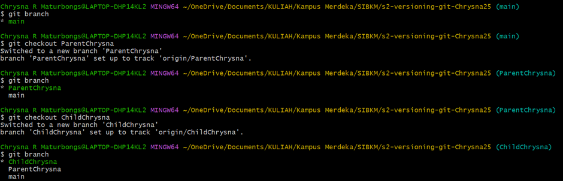

## Tugas 1 Versioning
1. Menginisialisasi repo git (local)

- Masuk pada directory
- Inisialisasi dengan git init
- Menambahkan menggunakan git add .

- Membuat file README.md pada IDE tools(VS Code)

2. Membuat branch Parent dan branch Child

- git remote untuk ngepush update repo

mem
### Test fast forward from child