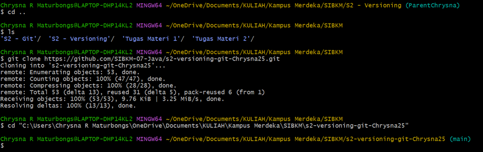

## Tugas 1 Versioning
1. Menginisialisasi repo git (local)

- Masuk pada directory
- Inisialisasi dengan git init
- Menambahkan menggunakan git add .

- Membuat file README.md pada IDE tools(VS Code)

2. Membuat branch Parent dan branch Child

- git remote untuk ngepush update repo

### Test fast forward from child

- Melakukan perubahan pada ChildChrysna
- Merge branch Child dan branch Parent menggunakan fast forward
  

menambahkan langkah-langkah dari ParentChrysna

## Three Way Merged from Child
- Kita perlu mengclone hasil dari repository sebelumnya seperti gambar dibawah

- Mengecek Parent dan Child di repository 
